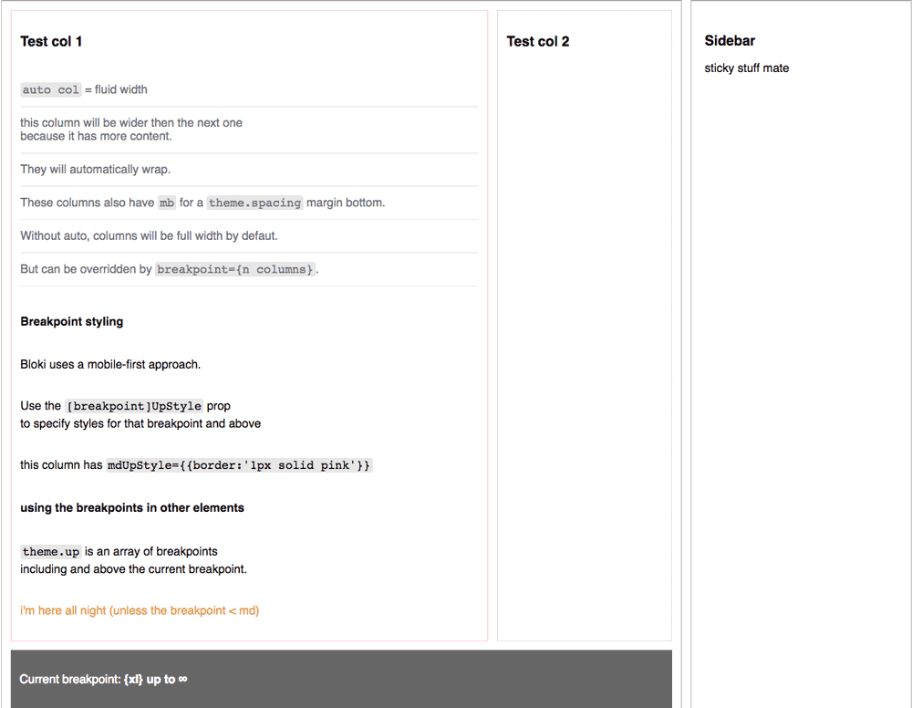

Bloki
--

A grid system for React.  
Uses the new context API – so **you need to use react > 16.3.0**

edit (after actually trying to use it in a project): this sucks, currently working on making it less sucks.


### Features:
  - Uses flexbox
  - Optional automatic column widths / wrapping
  - 'Theme' context which allows you to specify column spacing used, amount of columns in the grid, breakpoints
  - Breakpoint specific styles / breakpoint & up styles
  - Render function can be used to access current breakpoint for easily changing content at different viewport sizes
  - `sticky` prop to apply sticky / -webkit-sticky to the element
  - uses `react-emotion` for the styles, so you don't have to worry about prefixes, and you shouldn't run into specificity problems when using a library like `react-emotion` or `styled-components` yourself.

 ---
🚨 I've not yet used this in a real project. There are some quirks / bugs. Please send me PRs or issues if you have problems :)



### Overview
The API is similar to `material-ui` Grid. 
Rows and columns are specified by the prop `row` or `col`.
You can specify which dom element (string e.g 'aside'), or component (e.g MyClass) to use with the `component` prop (defaults to div).

```js
<BlokiProvider theme={theme}>
  <Bloki row component="main">
    <Bloki col lg={4} md={12}>
      1
    </Bloki>
      <Bloki col lg={4} md={6}>
      2
    </Bloki>
      <Bloki col lg={4} md={6}>
      3
    </Bloki>	
  </Bloki>
</BlokiProvider>
```

Setup:
--
  install and import
  ```
  import Bloki, { BlokiProvider } from 'bloki'
  ```
  Firstly you'll want to provide your own `theme` object to the `<BlokiProvider/>`.
  
  ```js
  const blokiTheme = {
    spacing: 12,
    columns: 12,
    breakpoints: {
      xs: 360,
      sm: 720,
      md: 900,
      lg: 1080,
    }
  }
 ```
  Bloki needs to be wrapped in a `<BlokiProvider>`, You can make this the root of your app if you like.
  ```js
  class App extends Component {
  render() {
    return (
     <BlokiProvider theme={theme}>
       ...
     </BlokiProvider>
  ```
  
Now you can start building your grid!
  
### The container

  Let's say you want a classic centered max-width container for your whole App ( full width below `md`).
  ```js
  const styles = {
    root: {
      margin: '0 auto',
    },
  }
  <Bloki 
   style={styles.root} 
   justify="center" 
   mdUpStyle={{maxWidth: blokiTheme.breakpoints.sm - 32}} 
   lgUpStyle={{maxWidth: blokiTheme.breakpoints.md - 32}}
  >
    <Stuff/>
  </Bloki>
  ```

### The row
Your row houses a row of columns, and is specified with the `row` prop.
```js
<Bloki row>
	...
</Bloki>
```
If you are nesting rows or for some reason you want to apply e.g a background directly to the row element, you can add the `nest` prop to give it negative margins.

### The column
Columns are specified with the `col` prop.


```js
<Bloki col auto xs={12} sm={6}>
...
</Bloki>
```


  ## theme
  the theme is quite powerful for responsive styling / content. 
  You can access it inside a `<Bloki/>` with a render function:
```js
<Bloki>
  {theme => (
    <Bloki row>
      <Bloki col auto>
      <h1 className={theme.up.includes('md') ? "bigger-heading" : "bigish-heading"}>
      Bloki
      </h1>
        current breakpoint: {theme.currentBreakpoint}
        spacing: {theme.spacing}
      </Bloki>
    </Bloki>
    )
  }
</Bloki>
```

## Theme options
| Prop        				| Default       | type 			| Desc  |
| ------------- 			|-------------	| -----			|-----	|
|	spacing | 16 | number | the spacing unit used for the column padding and the margins |
|	columns | 12 | number | the amount of columns in your grid |
|	innerSpacing | true | boolean | A global flag for removing padding from the columns |
|	breakpoints | { xs: 476, sm: 768, md: 992, lg: 1300 } | object | The max viewport width for each breakpoint |

## Theme read-only
| Prop        				| Default       | type 			| Desc  |
| ------------- 			|-------------	| -----			|-----	|
 | currentBreakpoint | string | The current breakpoint |
 |up | array | An array of breakpoints including and above the current breakpoint.|


## Bloki props
  
| Prop        					| Default       | type 			| Desc  |
| ------------- 				|-------------	| -----			|-----	|
|wrap | true | boolean | forces flexDirection: 'nowrap' if false |
|align | 'stretch'| string | align-items, same as flexbox spec | 
|justify | 'flex-start'| string | justify-content, same as flexbox spec  |
|innerSpacing | null | boolean | disable the spacing (padding) for this element |
|sticky | false| boolean | make the element sticky (see: https://caniuse.com/#feat=css-sticky) |
|col | false| boolean | specify a column |
|row | false| boolean | specify a row |
|auto | false| boolean | auto columns have `flexGrow: 1` and no max-width or flex-basis, so they should automatically size / wrap themselves |
|nest | false| boolean | gives a row negative margin, and no max-width / flex-basis, for properly nesting rows inside rows |
|xs | null| number | the amount of columns a `col` should span up to/above the `xs` breakpoint |
|sm | null| number | the amount of columns a `col` should span at/above the `sm` breakpoint |
|md | null| number | the amount of columns a `col` should span at/above the `md` breakpoint |
|lg | null| number | the amount of columns a `col` should span at/above the `lg` breakpoint |
|xl | null| number | the amount of columns a `col` should span above the `lg` breakpoint |
|mb | false| boolean OR number | if true, adds a margin bottom of `theme.spacing` or the `spacing` prop if provided. Otherwise a specific number can be provided. |
|xsUpStyle | null| object | the style to be applied including & above the `xs` breakpoint |
|smUpStyle | null| object | the style to be applied including & above the `sm` breakpoint |
|mdUpStyle | null| object | the style to be applied including & above the `md` breakpoint |
|lgUpStyle | null| object | the style to be applied including & above the `lg` breakpoint |
|xlUpStyle | null| object | the style to be applied above the `lg` breakpoint |
|debug | false | boolean | log some stuff to the console (current breakpoint, viewport width, breakpoint styles ) |


### dev stuff
Tests are not yet very extensive but written with Enzyme / Jest    
`npm run dist` to transpile the code to the lib directory  
`npm run start` to run the example / playground app via webpack dev server (imports Bloki from /src)
